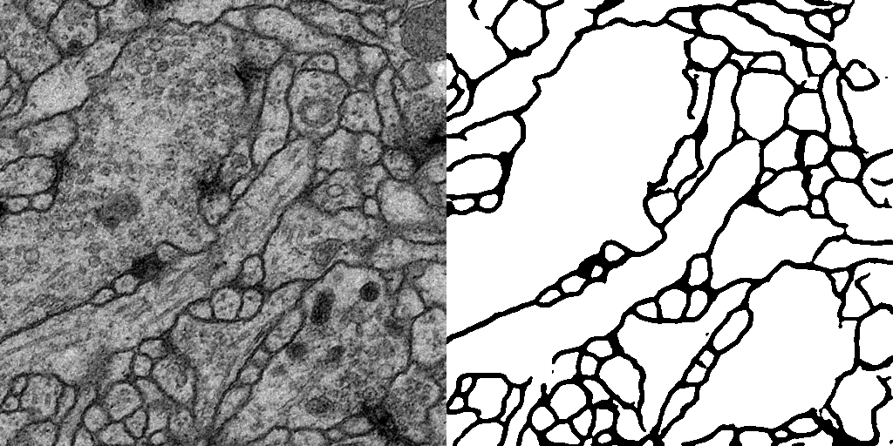
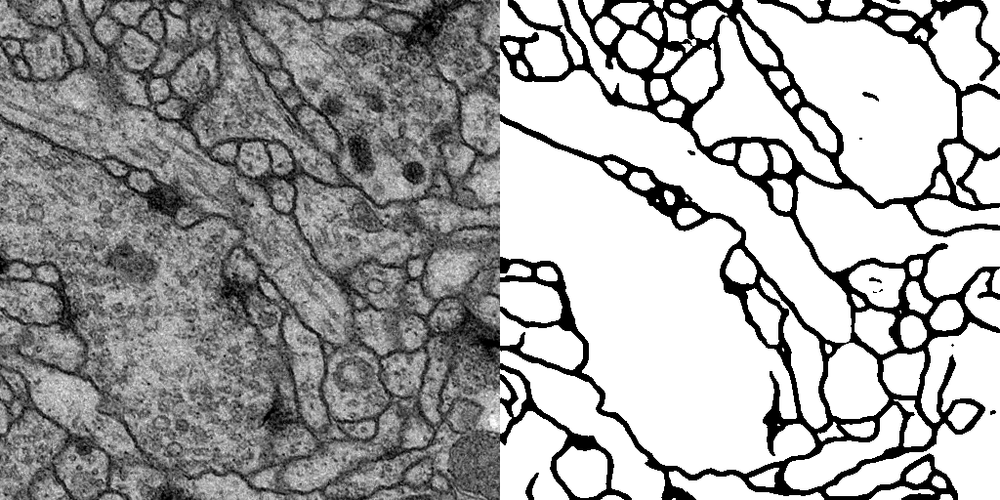
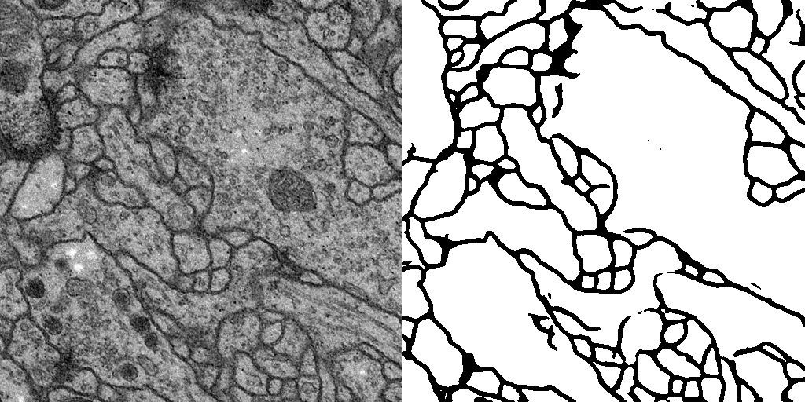

# U-net

A simple pytorch implementation of U-net, as described in the paper: https://arxiv.org/abs/1505.04597



This project is meant to be a dead-simple implementation of the model.
The only dependencies are pytorch, numpy and pillow.

The main differences with the paper are:
- no padding in the pooling, which makes handling dimensions easier
- no weight balancing in the softmax to deal with class inbalance

## Example dataset

The example dataset is from the ISBI Challenge. More information here: http://brainiac2.mit.edu/isbi_challenge/.

A few outputs from the test dataset, after 200 iterations:





Download and put the files in the `data` directory. It should be like this:
```
data
├── test-volume.tif
├── train-labels.tif
└── train-volume.tif
```

## Installation

```
pip install torch numpy pillow
mkdir model
```

## Training

```
python train.py
```

## Prediction on test dataset

```
python predict.py
```

## Bibliography:
- https://github.com/milesial/Pytorch-UNet
